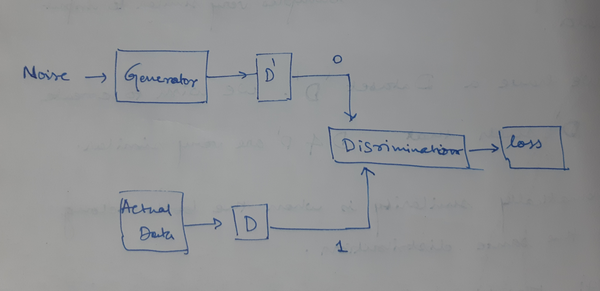

# GAN_MLP
This repository contains my experiments with the Generative Adversarial setting of Neural Networks.
 
The name very much explains it up. GANs are a class of generative models. GANs were introduced to the world by Ian J. Goodfellow and group of researchers at university of Montreal in 2014. Their paper titled 'Generative Adversarial Nets' - https://papers.nips.cc/paper/5423-generative-adversarial-nets.pdf is seen as one of the millenial papers in deep learing. 

                                    

GANS are pitched against other generative models such as: 
1. Probabaility  Distribution 
2. Pixel CNN
3. Pixel RNN
4. Varitional Auto Encoders

These are the results generated on MNIST Digit data set.

GANS have been used extensively in many areas. Few very prominant and unique ones are 
1. Super Resolution GAN -https://arxiv.org/pdf/1609.04802.pdf for image resolution.
2. Progressive GAN - https://arxiv.org/pdf/1710.10196.pdf for image generation.
3. Music GAN - http://mogren.one/publications/2016/c-rnn-gan/mogren2016crnngan.pdf for music generation
4. MaskGAN - https://arxiv.org/abs/1801.07736 for Text generation.
